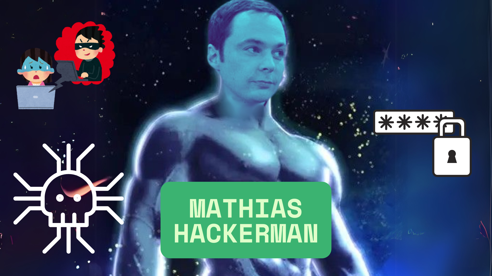

## Bem vindos ao meu github!!

  <a href="https://github.com/seu-usuario">
  
  

## Sobre Mim

## Habilidades

 
    
    
    
    
    
    
    
    

 

<picture>
  <source media="(prefers-color-scheme: dark)" srcset="https://raw.githubusercontent.com/debysouza/debysouza/output/github-contribution-grid-snake-dark.svg">
  <source media="(prefers-color-scheme: light)" srcset="https://raw.githubusercontent.com/debysouza/debysouza/output/github-contribution-grid-snake.svg">
  
</picture>

## Email de contato

 
    

 
!GitHub Stats
